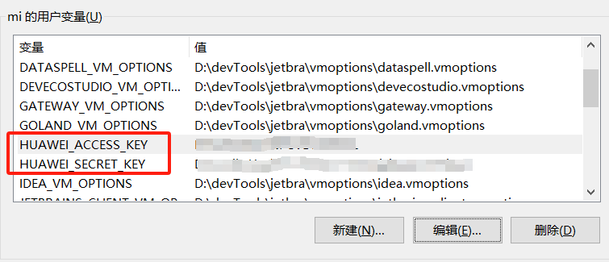
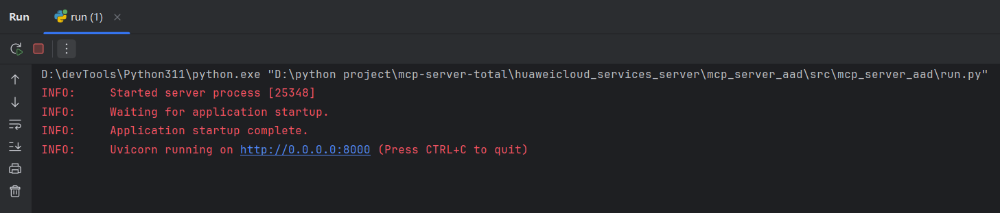

# mcp-server

[](https://github.com/manusa/kubernetes-mcp-server/blob/main/LICENSE)
[](https://github.com/HuaweiCloudDeveloper/mcp-server/actions/workflows/ci.yaml)
[](https://github.com/HuaweiCloudDeveloper/mcp-server/pulls)
[](https://github.com/HuaweiCloudDeveloper/mcp-server/commits/main)
[](https://github.com/HuaweiCloudDeveloper/mcp-server)

[English](./README.md)

华为MCP Server是基于华为云服务构建的模型上下文协议服务器，为大型AI模型提供安全可控的云服务访问能力。通过标准化的MCP协议规范，使AI助手能在对话流中操作华为云资源，支持ECS、OBS、GaussDB等核心服务及广泛使用的云产品。
## mcp-server 目录

- [实用文档](#实用文档)
- [Demo](#Demo)
- [运行指南](#运行指南)
- [功能点(Tools)](#功能点Tools)
- [贡献指南](#贡献指南)

## 实用文档
- [使用DAS MCP实现数据库对话式运维](https://support.huaweicloud.com/bestpractice-das/das_best_practice_01_0017.html) 

## Demo

[Demo](https://github.com/user-attachments/assets/f0cdc18f-e3dc-401e-9ed5-5185e710b1a7)

该Demo展示了使用Cline与华为MCP Server创建并删除ECS实例的全过程。

## 运行指南

### 1. 依赖安装

- 安装 [uv](https://docs.astral.sh/uv/getting-started/installation/) (推荐)
- 安装 `3.10` 及以上版本的 [python](https://www.python.org/downloads/)

### 2. 环境变量设置

准备AK、SK并设置到环境变量

- ak 环境变量名:  HUAWEI_ACCESS_KEY
- sk 环境变量名:  HUAWEI_SECRET_KEY



### 3. 运行方法

以运行 `mcp-server-ecs` 服务举例

#### 使用 `uv` 运行 (推荐)

```shell
# 进入项目的根路径
cd /path/to/you/mcp-server

# 启动服务
uv run mcp-server-ecs
```

可执行 `uv run mcp-server-ecs -h` 查看使用帮助，使用命令行可选参数可覆盖子项目中 `config.yaml` 文件的配置值 

```text
usage: mcp-server-ecs [-h] [-p PORT] [-t {http,sse,stdio}]

MCP Server

options:
  -h, --help            show this help message and exit
  -p, --port PORT       Port number
  -t, --transport {http,sse,stdio}
                        Transport of MCP Server
```

#### 使用 `python` 运行 


```shell
# 进入项目的根路径
cd /path/to/you/mcp-server

# 安装依赖
pip install -e .

# 进入指定服务(mcp-server-ecs)路径
cd huaweicloud_services_server/mcp_server_ecs/src/mcp_server_ecs

# 启动服务
python run.py
```

## MCP市场集成

* [Cline](https://cline.bot/mcp-marketplace)
* 在cline 中配置 mcp 服务使用sse的方式，json格式如下
```json
{
  "mcpServers": {
    "mcp_server_ecs": {
      "url": "http://localhost:8888/sse",
      "disabled": false,
      "autoApprove": []
    }
  }
}
```

## 功能点(Tools)

<!DOCTYPE html>
<html>
<body>
<table border="1" cellspacing="0" cellpadding="5">
  <tr>
    <th>Group Name</th>
    <th>Product Name</th>
    <th>Product Short</th>
  </tr>
<tr>
    <td rowspan="1">云商店</td>
    <td>商品和订单</td>
    <td><a href="https://github.com/HuaweiCloudDeveloper/mcp-server/tree/master-dev/huaweicloud_marketplace_server">Product&Order</a></td>
  </tr>
  <tr>
    <td rowspan="25">管理与监管</td>
    <td>云监控服务</td>
    <td><a href="https://github.com/HuaweiCloudDeveloper/mcp-server/tree/master-dev/huaweicloud_services_server/mcp_server_ces">CES</a></td>
  </tr>
  <tr>
    <td>云日志服务</td>
    <td><a href="https://github.com/HuaweiCloudDeveloper/mcp-server/tree/master-dev/huaweicloud_services_server/mcp_server_lts">LTS</a></td>
  </tr>
  <tr>
    <td>统一身份认证服务</td>
    <td><a href="https://github.com/HuaweiCloudDeveloper/mcp-server/tree/master-dev/huaweicloud_services_server/mcp_server_iam">IAM</a></td>
  </tr>
  <tr>
    <td>云审计服务</td>
    <td><a href="https://github.com/HuaweiCloudDeveloper/mcp-server/tree/master-dev/huaweicloud_services_server/mcp_server_cts">CTS</a></td>
  </tr>
  <tr>
    <td>标签管理服务</td>
    <td><a href="https://github.com/HuaweiCloudDeveloper/mcp-server/tree/master-dev/huaweicloud_services_server/mcp_server_tms">TMS</a></td>
  </tr>
  <tr>
    <td>资源模板服务</td>
    <td>RTS</td>
  </tr>
  <tr>
    <td>企业项目管理服务</td>
    <td><a href="https://github.com/HuaweiCloudDeveloper/mcp-server/tree/master-dev/huaweicloud_services_server/mcp_server_eps">EPS</a></td>
  </tr>
  <tr>
    <td>资源管理服务</td>
    <td><a href="https://github.com/HuaweiCloudDeveloper/mcp-server/tree/master-dev/huaweicloud_services_server/mcp_server_rms">RMS</a></td>
  </tr>
  <tr>
    <td>消息通知服务</td>
    <td><a href="https://github.com/HuaweiCloudDeveloper/mcp-server/tree/master-dev/huaweicloud_services_server/mcp_server_smn">SMN</a></td>
  </tr>
  <tr>
    <td>应用性能管理</td>
    <td><a href="https://github.com/HuaweiCloudDeveloper/mcp-server/tree/master-dev/huaweicloud_services_server/mcp_server_apm">APM</a></td>
  </tr>
  <tr>
    <td>应用运维管理</td>
    <td><a href="https://github.com/HuaweiCloudDeveloper/mcp-server/tree/master-dev/huaweicloud_services_server/mcp_server_aom">AOM</a></td>
  </tr>
  <tr>
    <td>组织</td>
    <td>Organizations</td>
  </tr>
  <tr>
    <td>资源访问管理</td>
    <td><a href="https://github.com/HuaweiCloudDeveloper/mcp-server/tree/master-dev/huaweicloud_services_server/mcp_server_ram">RAM</a></td>
  </tr>
  <tr>
    <td>配置审计</td>
    <td>Config</td>
  </tr>
  <tr>
    <td>IAM 身份中心</td>
    <td>IdentityCenter</td>
  </tr>
  <tr>
    <td>优化顾问</td>
    <td>OA</td>
  </tr>
  <tr>
    <td>资源治理中心</td>
    <td><a href="https://github.com/HuaweiCloudDeveloper/mcp-server/tree/master-dev/huaweicloud_services_server/mcp_server_rgc">RGC</a></td>
  </tr>
  <tr>
    <td>访问分析</td>
    <td>IAMAccessAnalyzer</td>
  </tr>
  <tr>
    <td>IAM 身份中心身份源</td>
    <td>IdentityCenterStore</td>
  </tr>
  <tr>
    <td>IAM 身份中心 SCIM</td>
    <td>IdentityCenterSCIM</td>
  </tr>
  <tr>
    <td>IAM 身份中心 OIDC</td>
    <td>IdentityCenterOIDC</td>
  </tr>
  <tr>
    <td>安全令牌服务</td>
    <td><a href="https://github.com/HuaweiCloudDeveloper/mcp-server/tree/master-dev/huaweicloud_services_server/mcp_server_sts">STS</a></td>
  </tr>
  <tr>
    <td>云运维中心</td>
    <td><a href="https://github.com/HuaweiCloudDeveloper/mcp-server/tree/master-dev/huaweicloud_services_server/mcp_server_coc">COC</a></td>
  </tr>
  <tr>
    <td>消息通知服务Global</td>
    <td><a href="https://github.com/HuaweiCloudDeveloper/mcp-server/tree/master-dev/huaweicloud_services_server/mcp_server_smnglobal">SMNGLOBAL</a></td>
  </tr>
  <tr>
    <td>IAM 身份中心 PortalAPI</td>
    <td>IdentityCenterPortalAPI</td>
  </tr>
  <tr>
    <td rowspan="1">区块链</td>
    <td>区块链服务</td>
    <td><a href="https://github.com/HuaweiCloudDeveloper/mcp-server/tree/master-dev/huaweicloud_services_server/mcp_server_bcs">BCS</a></td>
  </tr>
  <tr>
    <td rowspan="7">开天aPaaS</td>
    <td>云消息服务</td>
    <td>KooMessage</td>
  </tr>
  <tr>
    <td>云地图服务</td>
    <td>KooMap</td>
  </tr>
  <tr>
    <td>交换数据空间</td>
    <td><a href="https://github.com/HuaweiCloudDeveloper/mcp-server/tree/master-dev/huaweicloud_services_server/mcp_server_eds">EDS</a></td>
  </tr>
  <tr>
    <td>开天集成工作台</td>
    <td><a href="https://github.com/HuaweiCloudDeveloper/mcp-server/tree/master-dev/huaweicloud_services_server/mcp_server_mssi">MSSI</a></td>
  </tr>
  <tr>
    <td>云手机服务</td>
    <td>KooPhone</td>
  </tr>
  <tr>
    <td>组织成员账号</td>
    <td>OrgID</td>
  </tr>
  <tr>
    <td>应用平台</td>
    <td>AppStage</td>
  </tr>
  <tr>
    <td rowspan="1">运营</td>
    <td>运营能力开放</td>
    <td>BSS</td>
  </tr>
  <tr>
    <td rowspan="5">容器</td>
    <td>云容器引擎</td>
    <td><a href="https://github.com/HuaweiCloudDeveloper/mcp-server/tree/master-dev/huaweicloud_services_server/mcp_server_cce">CCE</a></td>
  </tr>
  <tr>
    <td>云容器实例</td>
    <td><a href="https://github.com/HuaweiCloudDeveloper/mcp-server/tree/master-dev/huaweicloud_services_server/mcp_server_cci">CCI</a></td>
  </tr>
  <tr>
    <td>容器镜像服务</td>
    <td><a href="https://github.com/HuaweiCloudDeveloper/mcp-server/tree/master-dev/huaweicloud_services_server/mcp_server_swr">SWR</a></td>
  </tr>
  <tr>
    <td>应用编排服务</td>
    <td>AOS</td>
  </tr>
  <tr>
    <td>应用服务网格</td>
    <td><a href="https://github.com/HuaweiCloudDeveloper/mcp-server/tree/master-dev/huaweicloud_services_server/mcp_server_asm">ASM</a></td>
  </tr>
  <tr>
    <td rowspan="12">网络</td>
    <td>虚拟私有云</td>
    <td><a href="https://github.com/HuaweiCloudDeveloper/mcp-server/tree/master-dev/huaweicloud_services_server/mcp_server_vpc">VPC</a></td>
  </tr>
  <tr>
    <td>弹性负载均衡</td>
    <td><a href="https://github.com/HuaweiCloudDeveloper/mcp-server/tree/master-dev/huaweicloud_services_server/mcp_server_elb">ELB</a></td>
  </tr>
  <tr>
    <td>NAT网关</td>
    <td><a href="https://github.com/HuaweiCloudDeveloper/mcp-server/tree/master-dev/huaweicloud_services_server/mcp_server_nat">NAT</a></td>
  </tr>
  <tr>
    <td>弹性公网IP</td>
    <td><a href="https://github.com/HuaweiCloudDeveloper/mcp-server/tree/master-dev/huaweicloud_services_server/mcp_server_eip">EIP</a></td>
  </tr>
  <tr>
    <td>云专线</td>
    <td>DC</td>
  </tr>
  <tr>
    <td>虚拟专用网络</td>
    <td><a href="https://github.com/HuaweiCloudDeveloper/mcp-server/tree/master-dev/huaweicloud_services_server/mcp_server_vpn">VPN</a></td>
  </tr>
  <tr>
    <td>VPC终端节点 </td>
    <td><a href="https://github.com/HuaweiCloudDeveloper/mcp-server/tree/master-dev/huaweicloud_services_server/mcp_server_vpcep">VPCEP</a></td>
  </tr>
  <tr>
    <td>云连接</td>
    <td>CC</td>
  </tr>
  <tr>
    <td>企业路由器</td>
    <td><a href="https://github.com/HuaweiCloudDeveloper/mcp-server/tree/master-dev/huaweicloud_services_server/mcp_server_er">ER</a></td>
  </tr>
  <tr>
    <td>全球加速</td>
    <td>GA</td>
  </tr>
  <tr>
    <td>企业连接</td>
    <td>EC</td>
  </tr>
  <tr>
    <td>全域弹性公网IP</td>
    <td><a href="https://github.com/HuaweiCloudDeveloper/mcp-server/tree/master-dev/huaweicloud_services_server/mcp_server_geip">GEIP</a></td>
  </tr>
  <tr>
    <td rowspan="11">计算</td>
    <td>弹性云服务器</td>
    <td><a href="https://github.com/HuaweiCloudDeveloper/mcp-server/tree/master-dev/huaweicloud_services_server/mcp_server_ecs">ECS</a></td>
  </tr>
  <tr>
    <td>GPU加速云服务器</td>
    <td>GACS</td>
  </tr>
  <tr>
    <td>FPGA加速云服务器</td>
    <td>FACS</td>
  </tr>
  <tr>
    <td>裸金属服务器</td>
    <td><a href="https://github.com/HuaweiCloudDeveloper/mcp-server/tree/master-dev/huaweicloud_services_server/mcp_server_bms">BMS</a></td>
  </tr>
  <tr>
    <td>专属主机</td>
    <td>DeH</td>
  </tr>
  <tr>
    <td>弹性伸缩</td>
    <td><a href="https://github.com/HuaweiCloudDeveloper/mcp-server/tree/master-dev/huaweicloud_services_server/mcp_server_as">AS</a></td>
  </tr>
  <tr>
    <td>镜像服务</td>
    <td><a href="https://github.com/HuaweiCloudDeveloper/mcp-server/tree/master-dev/huaweicloud_services_server/mcp_server_ims">IMS</a></td>
  </tr>
  <tr>
    <td>函数工作流</td>
    <td><a href="https://github.com/HuaweiCloudDeveloper/mcp-server/tree/master-dev/huaweicloud_services_server/mcp_server_functiongraph">FunctionGraph</a></td>
  </tr>
  <tr>
    <td>VR云渲游平台</td>
    <td>CVR</td>
  </tr>
  <tr>
    <td>云手机</td>
    <td><a href="https://github.com/HuaweiCloudDeveloper/mcp-server/tree/master-dev/huaweicloud_services_server/mcp_server_cph">CPH</a></td>
  </tr>
  <tr>
    <td>容量管理服务</td>
    <td><a href="https://github.com/HuaweiCloudDeveloper/mcp-server/tree/master-dev/huaweicloud_services_server/mcp_server_cms">CMS</a></td>
  </tr>
  <tr>
    <td rowspan="12">IoT物联网</td>
    <td>智能边缘平台</td>
    <td><a href="https://github.com/HuaweiCloudDeveloper/mcp-server/tree/master-dev/huaweicloud_services_server/mcp_server_ief">IEF</a></td>
  </tr>
  <tr>
    <td>OceanBooster</td>
    <td>OceanBooster</td>
  </tr>
  <tr>
    <td>设备发放</td>
    <td>IoTDP</td>
  </tr>
  <tr>
    <td>车路协同平台</td>
    <td>ocv2x</td>
  </tr>
  <tr>
    <td>OceanConnect 车联网</td>
    <td>OCIOV</td>
  </tr>
  <tr>
    <td>设备接入</td>
    <td>IoTDA</td>
  </tr>
  <tr>
    <td>物联网应用构建器</td>
    <td>OCStudio</td>
  </tr>
  <tr>
    <td>物联网数据分析</td>
    <td>IoTAnalytics</td>
  </tr>
  <tr>
    <td> 路网数字化服务</td>
    <td><a href="https://github.com/HuaweiCloudDeveloper/mcp-server/tree/master-dev/huaweicloud_services_server/mcp_server_dris">DRIS</a></td>
  </tr>
  <tr>
    <td>IoT边缘</td>
    <td>IoTEdge</td>
  </tr>
  <tr>
    <td>全球SIM联接</td>
    <td><a href="https://github.com/HuaweiCloudDeveloper/mcp-server/tree/master-dev/huaweicloud_services_server/mcp_server_gsl">GSL</a></td>
  </tr>
  <tr>
    <td>设备接入管理</td>
    <td>IoTDM</td>
  </tr>
  <tr>
    <td rowspan="5">CDN与智能边缘</td>
    <td>内容分发网络</td>
    <td>CDN</td>
  </tr>
  <tr>
    <td>智能边缘平台</td>
    <td><a href="https://github.com/HuaweiCloudDeveloper/mcp-server/tree/master-dev/huaweicloud_services_server/mcp_server_ief">IEF</a></td>
  </tr>
  <tr>
    <td>智能边缘小站</td>
    <td>CloudPond</td>
  </tr>
  <tr>
    <td>智能边缘云</td>
    <td><a href="https://github.com/HuaweiCloudDeveloper/mcp-server/tree/master-dev/huaweicloud_services_server/mcp_server_iec">IEC</a></td>
  </tr>
  <tr>
    <td>智能边缘小站</td>
    <td><a href="https://github.com/HuaweiCloudDeveloper/mcp-server/tree/master-dev/huaweicloud_services_server/mcp_server_ies">IES</a></td>
  </tr>
  <tr>
    <td rowspan="5">迁移</td>
    <td>云迁移中心</td>
    <td>CMC</td>
  </tr>
  <tr>
    <td>对象存储迁移服务</td>
    <td><a href="https://github.com/HuaweiCloudDeveloper/mcp-server/tree/master-dev/huaweicloud_services_server/mcp_server_oms">OMS</a></td>
  </tr>
  <tr>
    <td>云数据迁移</td>
    <td><a href="https://github.com/HuaweiCloudDeveloper/mcp-server/tree/master-dev/huaweicloud_services_server/mcp_server_cdm">CDM</a></td>
  </tr>
  <tr>
    <td>数据复制服务</td>
    <td><a href="https://github.com/HuaweiCloudDeveloper/mcp-server/tree/master-dev/huaweicloud_services_server/mcp_server_drs">DRS</a></td>
  </tr>
  <tr>
    <td>主机迁移服务</td>
    <td>SMS</td>
  </tr>
  <tr>
    <td rowspan="2">专属云</td>
    <td>专属计算集群服务</td>
    <td>DCC</td>
  </tr>
  <tr>
    <td>裸金属服务器</td>
    <td><a href="https://github.com/HuaweiCloudDeveloper/mcp-server/tree/master-dev/huaweicloud_services_server/mcp_server_bms">BMS</a></td>
  </tr>
  <tr>
    <td rowspan="19">软件开发生产线</td>
    <td>需求管理</td>
    <td><a href="https://github.com/HuaweiCloudDeveloper/mcp-server/tree/master-dev/huaweicloud_services_server/mcp_server_projectman">ProjectMan</a></td>
  </tr>
  <tr>
    <td>代码托管</td>
    <td><a href="https://github.com/HuaweiCloudDeveloper/mcp-server/tree/master-dev/huaweicloud_services_server/mcp_server_codehub">CodeHub</a></td>
  </tr>
  <tr>
    <td>流水线</td>
    <td><a href="https://github.com/HuaweiCloudDeveloper/mcp-server/tree/master-dev/huaweicloud_services_server/mcp_server_cloudpipeline">CloudPipeline</a></td>
  </tr>
  <tr>
    <td>代码检查</td>
    <td>CodeCheck</td>
  </tr>
  <tr>
    <td>移动应用测试</td>
    <td>MobileAppTest</td>
  </tr>
  <tr>
    <td>测试计划</td>
    <td><a href="https://github.com/HuaweiCloudDeveloper/mcp-server/tree/master-dev/huaweicloud_services_server/mcp_server_cloudtest">CloudTest</a></td>
  </tr>
  <tr>
    <td>意见反馈</td>
    <td>VOC</td>
  </tr>
  <tr>
    <td>CloudIDE</td>
    <td>CloudIDE</td>
  </tr>
  <tr>
    <td>大赛服务</td>
    <td>CodeCraft</td>
  </tr>
  <tr>
    <td>研发安全服务</td>
    <td>DevSecurity</td>
  </tr>
  <tr>
    <td>应用管理与运维平台</td>
    <td>ServiceStage</td>
  </tr>
  <tr>
    <td>云性能测试服务</td>
    <td><a href="https://github.com/HuaweiCloudDeveloper/mcp-server/tree/master-dev/huaweicloud_services_server/mcp_server_cpts">CPTS</a></td>
  </tr>
  <tr>
    <td>云应用引擎</td>
    <td><a href="https://github.com/HuaweiCloudDeveloper/mcp-server/tree/master-dev/huaweicloud_services_server/mcp_server_cae">CAE</a></td>
  </tr>
  <tr>
    <td>制品仓库</td>
    <td>CodeArtsArtifact</td>
  </tr>
  <tr>
    <td>编译构建</td>
    <td><a href="https://github.com/HuaweiCloudDeveloper/mcp-server/tree/master-dev/huaweicloud_services_server/mcp_server_codeartsbuild">CodeArtsBuild</a></td>
  </tr>
  <tr>
    <td>代码检查</td>
    <td><a href="https://github.com/HuaweiCloudDeveloper/mcp-server/tree/master-dev/huaweicloud_services_server/mcp_server_codeartscheck">CodeArtsCheck</a></td>
  </tr>
  <tr>
    <td>部署</td>
    <td><a href="https://github.com/HuaweiCloudDeveloper/mcp-server/tree/master-dev/huaweicloud_services_server/mcp_server_codeartsdeploy">CodeArtsDeploy</a></td>
  </tr>
  <tr>
    <td>漏洞管理服务</td>
    <td><a href="https://github.com/HuaweiCloudDeveloper/mcp-server/tree/master-dev/huaweicloud_services_server/mcp_server_codeartsinspector">CodeArtsInspector</a></td>
  </tr>
  <tr>
    <td>流水线</td>
    <td>CodeArtsPipeline</td>
  </tr>
  <tr>
    <td rowspan="13">企业应用</td>
    <td>云解析服务</td>
    <td><a href="https://github.com/HuaweiCloudDeveloper/mcp-server/tree/master-dev/huaweicloud_services_server/mcp_server_dns">DNS</a></td>
  </tr>
  <tr>
    <td>华为云WeLink</td>
    <td>WeLink</td>
  </tr>
  <tr>
    <td>华为云会议</td>
    <td>Meeting</td>
  </tr>
  <tr>
    <td>语音通话</td>
    <td>VoiceCall</td>
  </tr>
  <tr>
    <td>消息&amp;短信</td>
    <td><a href="https://github.com/HuaweiCloudDeveloper/mcp-server/tree/master-dev/huaweicloud_services_server/mcp_server_msgsms">MSGSMS</a></td>
  </tr>
  <tr>
    <td>隐私保护通话</td>
    <td>PrivateNumber</td>
  </tr>
  <tr>
    <td>联络中心</td>
    <td>ContactCenter</td>
  </tr>
  <tr>
    <td>全栈专属服务</td>
    <td>FCS</td>
  </tr>
  <tr>
    <td>云管理网络</td>
    <td>CMN</td>
  </tr>
  <tr>
    <td>应用与数据集成平台</td>
    <td><a href="https://github.com/HuaweiCloudDeveloper/mcp-server/tree/master-dev/huaweicloud_services_server/mcp_server_roma">ROMA</a></td>
  </tr>
  <tr>
    <td>云桌面</td>
    <td>Workspace</td>
  </tr>
  <tr>
    <td>云应用</td>
    <td>WorkspaceApp</td>
  </tr>
  <tr>
    <td>消息&amp;短信(业务API)</td>
    <td>SMSApi</td>
  </tr>
  <tr>
    <td rowspan="5">开发者工具</td>
    <td>DevStar</td>
    <td>DevStar</td>
  </tr>
  <tr>
    <td>开源平台</td>
    <td>OpenSource</td>
  </tr>
  <tr>
    <td>华为云CLI</td>
    <td>HCloud CLI</td>
  </tr>
  <tr>
    <td>APIExplorer</td>
    <td>APIExplorer</td>
  </tr>
  <tr>
    <td>FlowCube</td>
    <td>FlowCube</td>
  </tr>
  <tr>
    <td rowspan="66">人工智能</td>
    <td>机器学习服务</td>
    <td>MLS</td>
  </tr>
  <tr>
    <td>自然语言处理</td>
    <td><a href="https://github.com/HuaweiCloudDeveloper/mcp-server/tree/master-dev/huaweicloud_services_server/mcp_server_nlp">NLP</a></td>
  </tr>
  <tr>
    <td>语言理解</td>
    <td>nlplu</td>
  </tr>
  <tr>
    <td>语言生成</td>
    <td>nlplg</td>
  </tr>
  <tr>
    <td>定制自然语言处理</td>
    <td>nlpc</td>
  </tr>
  <tr>
    <td>机器翻译</td>
    <td>nlpmt</td>
  </tr>
  <tr>
    <td>知识图谱</td>
    <td>nlpkg</td>
  </tr>
  <tr>
    <td>对话机器人服务</td>
    <td><a href="https://github.com/HuaweiCloudDeveloper/mcp-server/tree/master-dev/huaweicloud_services_server/mcp_server_cbs">CBS</a></td>
  </tr>
  <tr>
    <td>智能问答机器人</td>
    <td>QABot</td>
  </tr>
  <tr>
    <td>智能话务机器人</td>
    <td>PhoneBot</td>
  </tr>
  <tr>
    <td>智能对话质检</td>
    <td>cbssa</td>
  </tr>
  <tr>
    <td>智能语音助手</td>
    <td>cbsc</td>
  </tr>
  <tr>
    <td>人脸识别服务</td>
    <td><a href="https://github.com/HuaweiCloudDeveloper/mcp-server/tree/master-dev/huaweicloud_services_server/mcp_server_frs">FRS</a></td>
  </tr>
  <tr>
    <td>内容审核</td>
    <td><a href="https://github.com/HuaweiCloudDeveloper/mcp-server/tree/master-dev/huaweicloud_services_server/mcp_server_moderation">Moderation</a></td>
  </tr>
  <tr>
    <td>内容审核-文本</td>
    <td>textmoderation</td>
  </tr>
  <tr>
    <td>内容审核-图像</td>
    <td>imagemoderation</td>
  </tr>
  <tr>
    <td>商超视频分析</td>
    <td>Smart Retail</td>
  </tr>
  <tr>
    <td>园区视频分析</td>
    <td>Smart Campus</td>
  </tr>
  <tr>
    <td>交通视频分析</td>
    <td>Smart Traffic</td>
  </tr>
  <tr>
    <td>文字识别</td>
    <td><a href="https://github.com/HuaweiCloudDeveloper/mcp-server/tree/master-dev/huaweicloud_services_server/mcp_server_ocr">OCR</a></td>
  </tr>
  <tr>
    <td>文字识别-通用类</td>
    <td>generalocr</td>
  </tr>
  <tr>
    <td>文字识别-证件类</td>
    <td>cardocr</td>
  </tr>
  <tr>
    <td>文字识别-票据类</td>
    <td>receiptocr</td>
  </tr>
  <tr>
    <td>文字识别-行业类</td>
    <td>domainocr</td>
  </tr>
  <tr>
    <td>文字识别-定制模板</td>
    <td>customocr</td>
  </tr>
  <tr>
    <td>图像识别</td>
    <td><a href="https://github.com/HuaweiCloudDeveloper/mcp-server/tree/master-dev/huaweicloud_services_server/mcp_server_image">Image</a></td>
  </tr>
  <tr>
    <td>名人识别</td>
    <td>ROC</td>
  </tr>
  <tr>
    <td>图像标签</td>
    <td>imagetagging</td>
  </tr>
  <tr>
    <td>深度学习服务</td>
    <td>DLS</td>
  </tr>
  <tr>
    <td>图引擎服务</td>
    <td><a href="https://github.com/HuaweiCloudDeveloper/mcp-server/tree/master-dev/huaweicloud_services_server/mcp_server_ges">GES</a></td>
  </tr>
  <tr>
    <td>图像搜索</td>
    <td><a href="https://github.com/HuaweiCloudDeveloper/mcp-server/tree/master-dev/huaweicloud_services_server/mcp_server_imagesearch">ImageSearch</a></td>
  </tr>
  <tr>
    <td>推荐系统</td>
    <td><a href="https://github.com/HuaweiCloudDeveloper/mcp-server/tree/master-dev/huaweicloud_services_server/mcp_server_res">RES</a></td>
  </tr>
  <tr>
    <td>智能水务</td>
    <td>iWater</td>
  </tr>
  <tr>
    <td>智能制造</td>
    <td>iManufacturing</td>
  </tr>
  <tr>
    <td>智能交通</td>
    <td>iTransport</td>
  </tr>
  <tr>
    <td>智能电力</td>
    <td>iPower</td>
  </tr>
  <tr>
    <td>智能金融</td>
    <td>iFinance</td>
  </tr>
  <tr>
    <td>智能零售</td>
    <td>iRetail</td>
  </tr>
  <tr>
    <td>机器翻译服务</td>
    <td>MTS</td>
  </tr>
  <tr>
    <td>AI开发平台</td>
    <td>ModelArts</td>
  </tr>
  <tr>
    <td>Huawei HiLens</td>
    <td>HiLens</td>
  </tr>
  <tr>
    <td>视频指纹</td>
    <td>VFP</td>
  </tr>
  <tr>
    <td>视频编辑</td>
    <td>VCP</td>
  </tr>
  <tr>
    <td>视频标签</td>
    <td>VCT</td>
  </tr>
  <tr>
    <td>机器翻译</td>
    <td>MT</td>
  </tr>
  <tr>
    <td>定制语音识别</td>
    <td>ASRC</td>
  </tr>
  <tr>
    <td>知识图谱</td>
    <td>KG</td>
  </tr>
  <tr>
    <td>视频分析服务</td>
    <td><a href="https://github.com/HuaweiCloudDeveloper/mcp-server/tree/master-dev/huaweicloud_services_server/mcp_server_vas">VAS</a></td>
  </tr>
  <tr>
    <td>语音交互服务</td>
    <td><a href="https://github.com/HuaweiCloudDeveloper/mcp-server/tree/master-dev/huaweicloud_services_server/mcp_server_sis">SIS</a></td>
  </tr>
  <tr>
    <td>录音文件识别</td>
    <td>LASR</td>
  </tr>
  <tr>
    <td>语音合成</td>
    <td>TTS</td>
  </tr>
  <tr>
    <td>实时语音识别</td>
    <td>RASR</td>
  </tr>
  <tr>
    <td>一句话识别</td>
    <td>ASR</td>
  </tr>
  <tr>
    <td>网络智能体</td>
    <td>NAIE</td>
  </tr>
  <tr>
    <td>人证核身服务</td>
    <td><a href="https://github.com/HuaweiCloudDeveloper/mcp-server/tree/master-dev/huaweicloud_services_server/mcp_server_ivs">IVS</a></td>
  </tr>
  <tr>
    <td>园区智能体</td>
    <td>CampusGo</td>
  </tr>
  <tr>
    <td>视频内容审核</td>
    <td><a href="https://github.com/HuaweiCloudDeveloper/mcp-server/tree/master-dev/huaweicloud_services_server/mcp_server_vcm">VCM</a></td>
  </tr>
  <tr>
    <td>医疗智能体</td>
    <td>eiHealth</td>
  </tr>
  <tr>
    <td>运筹优化算法服务</td>
    <td><a href="https://github.com/HuaweiCloudDeveloper/mcp-server/tree/master-dev/huaweicloud_services_server/mcp_server_oroas">OROAS</a></td>
  </tr>
  <tr>
    <td>盘古大模型</td>
    <td>PanguLargeModels</td>
  </tr>
  <tr>
    <td>天筹求解器服务</td>
    <td>OptVerse</td>
  </tr>
  <tr>
    <td>盘古大模型-应用开发</td>
    <td>AppKit</td>
  </tr>
  <tr>
    <td>八爪鱼自动驾驶云服务</td>
    <td>Octopus</td>
  </tr>
  <tr>
    <td>视频智能分析服务</td>
    <td><a href="https://github.com/HuaweiCloudDeveloper/mcp-server/tree/master-dev/huaweicloud_services_server/mcp_server_vias">VIAS</a></td>
  </tr>
  <tr>
    <td>大模型开发平台</td>
    <td>MaStudio</td>
  </tr>
  <tr>
    <td>数智融合计算服务</td>
    <td>DataArtsFabric</td>
  </tr>
  <tr>
    <td rowspan="4">工业软件</td>
    <td>工业数字主线云服务</td>
    <td><a href="https://github.com/HuaweiCloudDeveloper/mcp-server/tree/master-dev/huaweicloud_services_server/mcp_server_idt">IDT</a></td>
  </tr>
  <tr>
    <td>工业数字模型驱动引擎</td>
    <td>iDME</td>
  </tr>
  <tr>
    <td>工业数字模型驱动引擎(典型API体验)</td>
    <td>iDMEClassicAPI</td>
  </tr>
  <tr>
    <td>硬件开发工具链平台云服务</td>
    <td>CraftArtsIPDCenter</td>
  </tr>
  <tr>
    <td rowspan="1">企业网络</td>
    <td>视频加速服务</td>
    <td>VGVAS</td>
  </tr>
  <tr>
    <td rowspan="10">视频</td>
    <td>媒体转码</td>
    <td><a href="https://github.com/HuaweiCloudDeveloper/mcp-server/tree/master-dev/huaweicloud_services_server/mcp_server_mpc">MPC</a></td>
  </tr>
  <tr>
    <td>视频点播</td>
    <td><a href="https://github.com/HuaweiCloudDeveloper/mcp-server/tree/master-dev/huaweicloud_services_server/mcp_server_vod">VOD</a></td>
  </tr>
  <tr>
    <td>视频直播</td>
    <td>Live</td>
  </tr>
  <tr>
    <td>融合视频云服务</td>
    <td>CVCS</td>
  </tr>
  <tr>
    <td>云VR</td>
    <td>CloudVR</td>
  </tr>
  <tr>
    <td>媒体智能</td>
    <td>Media AI</td>
  </tr>
  <tr>
    <td>华为好望云服务</td>
    <td>IVM</td>
  </tr>
  <tr>
    <td>华为云实时音视频</td>
    <td>CloudRTC</td>
  </tr>
  <tr>
    <td>视频接入服务</td>
    <td><a href="https://github.com/HuaweiCloudDeveloper/mcp-server/tree/master-dev/huaweicloud_services_server/mcp_server_vis">VIS</a></td>
  </tr>
  <tr>
    <td>数字内容生产线</td>
    <td>MetaStudio</td>
  </tr>
  <tr>
    <td rowspan="10">应用中间件</td>
    <td>微服务引擎</td>
    <td><a href="https://github.com/HuaweiCloudDeveloper/mcp-server/tree/master-dev/huaweicloud_services_server/mcp_server_cse">CSE</a></td>
  </tr>
  <tr>
    <td>API网关</td>
    <td><a href="https://github.com/HuaweiCloudDeveloper/mcp-server/tree/master-dev/huaweicloud_services_server/mcp_server_apig">APIG</a></td>
  </tr>
  <tr>
    <td>分布式消息服务 Kafka</td>
    <td><a href="https://github.com/HuaweiCloudDeveloper/mcp-server/tree/master-dev/huaweicloud_services_server/mcp_server_kafka">Kafka</a></td>
  </tr>
  <tr>
    <td>分布式消息服务 RocketMQ</td>
    <td><a href="https://github.com/HuaweiCloudDeveloper/mcp-server/tree/master-dev/huaweicloud_services_server/mcp_server_rocketmq">RocketMQ</a></td>
  </tr>
  <tr>
    <td>分布式消息服务 RabbitMQ</td>
    <td>RabbitMQ</td>
  </tr>
  <tr>
    <td>分布式缓存服务</td>
    <td><a href="https://github.com/HuaweiCloudDeveloper/mcp-server/tree/master-dev/huaweicloud_services_server/mcp_server_dcs">DCS</a></td>
  </tr>
  <tr>
    <td>分布式缓存服务Redis</td>
    <td>DCSforRedis</td>
  </tr>
  <tr>
    <td>分布式缓存服务Memcached</td>
    <td>DCSforMemcached</td>
  </tr>
  <tr>
    <td>事件网格</td>
    <td><a href="https://github.com/HuaweiCloudDeveloper/mcp-server/tree/master-dev/huaweicloud_services_server/mcp_server_eg">EG</a></td>
  </tr>
  <tr>
    <td>多活高可用服务</td>
    <td><a href="https://github.com/HuaweiCloudDeveloper/mcp-server/tree/master-dev/huaweicloud_services_server/mcp_server_mas">MAS</a></td>
  </tr>
  <tr>
    <td rowspan="15">存储</td>
    <td>对象存储服务</td>
    <td><a href="https://github.com/HuaweiCloudDeveloper/mcp-server/tree/master-dev/huaweicloud_services_server/mcp_server_obs">OBS</a></td>
  </tr>
  <tr>
    <td>云硬盘</td>
    <td><a href="https://github.com/HuaweiCloudDeveloper/mcp-server/tree/master-dev/huaweicloud_services_server/mcp_server_evs">EVS</a></td>
  </tr>
  <tr>
    <td>云硬盘备份</td>
    <td>VBS</td>
  </tr>
  <tr>
    <td>云服务器备份</td>
    <td>CSBS</td>
  </tr>
  <tr>
    <td>存储容灾服务</td>
    <td><a href="https://github.com/HuaweiCloudDeveloper/mcp-server/tree/master-dev/huaweicloud_services_server/mcp_server_sdrs">SDRS</a></td>
  </tr>
  <tr>
    <td>弹性文件服务(SFS Turbo)</td>
    <td><a href="https://github.com/HuaweiCloudDeveloper/mcp-server/tree/master-dev/huaweicloud_services_server/mcp_server_sfsturbo">SFSTurbo</a></td>
  </tr>
  <tr>
    <td>数据快递服务</td>
    <td>DES</td>
  </tr>
  <tr>
    <td>直播加速</td>
    <td>LSA</td>
  </tr>
  <tr>
    <td>云备份</td>
    <td><a href="https://github.com/HuaweiCloudDeveloper/mcp-server/tree/master-dev/huaweicloud_services_server/mcp_server_cbr">CBR</a></td>
  </tr>
  <tr>
    <td>专属分布式存储服务</td>
    <td><a href="https://github.com/HuaweiCloudDeveloper/mcp-server/tree/master-dev/huaweicloud_services_server/mcp_server_dss">DSS</a></td>
  </tr>
  <tr>
    <td>专属企业存储服务</td>
    <td>DESS</td>
  </tr>
  <tr>
    <td>数据工坊</td>
    <td>DWR</td>
  </tr>
  <tr>
    <td>地图数据服务</td>
    <td>MapDS</td>
  </tr>
  <tr>
    <td>键值存储服务</td>
    <td><a href="https://github.com/HuaweiCloudDeveloper/mcp-server/tree/master-dev/huaweicloud_services_server/mcp_server_kvs">KVS</a></td>
  </tr>
  <tr>
    <td>知识湖存储</td>
    <td>LMS</td>
  </tr>
  <tr>
    <td rowspan="15">数据库</td>
    <td>云数据库</td>
    <td><a href="https://github.com/HuaweiCloudDeveloper/mcp-server/tree/master-dev/huaweicloud_services_server/mcp_server_rds">RDS</a></td>
  </tr>
  <tr>
    <td>文档数据库服务</td>
    <td><a href="https://github.com/HuaweiCloudDeveloper/mcp-server/tree/master-dev/huaweicloud_services_server/mcp_server_dds">DDS</a></td>
  </tr>
  <tr>
    <td>分布式数据库中间件</td>
    <td><a href="https://github.com/HuaweiCloudDeveloper/mcp-server/tree/master-dev/huaweicloud_services_server/mcp_server_ddm">DDM</a></td>
  </tr>
  <tr>
    <td>数据复制服务</td>
    <td><a href="https://github.com/HuaweiCloudDeveloper/mcp-server/tree/master-dev/huaweicloud_services_server/mcp_server_drs">DRS</a></td>
  </tr>
  <tr>
    <td>数据管理服务</td>
    <td><a href="https://github.com/HuaweiCloudDeveloper/mcp-server/tree/master-dev/huaweicloud_services_server/mcp_server_das">DAS</a></td>
  </tr>
  <tr>
    <td>多模NoSQL服务</td>
    <td>NoSQL</td>
  </tr>
  <tr>
    <td>云数据库产品总览</td>
    <td>DBS</td>
  </tr>
  <tr>
    <td>云数据库 TaurusDB</td>
    <td>TaurusDB</td>
  </tr>
  <tr>
    <td>云数据库 GeminiDB</td>
    <td>GeminiDB</td>
  </tr>
  <tr>
    <td>GeminiDB Cassandra 接口</td>
    <td>GaussDBforCassandra</td>
  </tr>
  <tr>
    <td>GeminiDB Mongo 接口</td>
    <td>GaussDBforMongo</td>
  </tr>
  <tr>
    <td>GeminiDB Redis接口</td>
    <td>GaussDBforRedis</td>
  </tr>
  <tr>
    <td>GeminiDB Influx 接口</td>
    <td>GaussDBforInflux</td>
  </tr>
  <tr>
    <td>云数据库 GaussDB</td>
    <td><a href="https://github.com/HuaweiCloudDeveloper/mcp-server/tree/master-dev/huaweicloud_services_server/mcp_server_gaussdbforopengauss">GaussDBforopenGauss</a></td>
  </tr>
  <tr>
    <td>数据库和应用迁移 UGO</td>
    <td>UGO</td>
  </tr>
  <tr>
    <td rowspan="17">安全与合规</td>
    <td>Web应用防火墙</td>
    <td><a href="https://github.com/HuaweiCloudDeveloper/mcp-server/tree/master-dev/huaweicloud_services_server/mcp_server_waf">WAF</a></td>
  </tr>
  <tr>
    <td>DDoS高防</td>
    <td><a href="https://github.com/HuaweiCloudDeveloper/mcp-server/tree/master-dev/huaweicloud_services_server/mcp_server_aad">AAD</a></td>
  </tr>
  <tr>
    <td>Anti-DDoS流量清洗</td>
    <td>Anti-DDoS</td>
  </tr>
  <tr>
    <td>企业主机安全</td>
    <td><a href="https://github.com/HuaweiCloudDeveloper/mcp-server/tree/master-dev/huaweicloud_services_server/mcp_server_hss">HSS</a></td>
  </tr>
  <tr>
    <td>数据加密服务-密钥管理</td>
    <td><a href="https://github.com/HuaweiCloudDeveloper/mcp-server/tree/master-dev/huaweicloud_services_server/mcp_server_kms">KMS</a></td>
  </tr>
  <tr>
    <td>数据加密服务-凭据管理</td>
    <td><a href="https://github.com/HuaweiCloudDeveloper/mcp-server/tree/master-dev/huaweicloud_services_server/mcp_server_csms">CSMS</a></td>
  </tr>
  <tr>
    <td>数据加密服务-密钥对管理</td>
    <td><a href="https://github.com/HuaweiCloudDeveloper/mcp-server/tree/master-dev/huaweicloud_services_server/mcp_server_kps">KPS</a></td>
  </tr>
  <tr>
    <td>数据库安全服务</td>
    <td><a href="https://github.com/HuaweiCloudDeveloper/mcp-server/tree/master-dev/huaweicloud_services_server/mcp_server_dbss">DBSS</a></td>
  </tr>
  <tr>
    <td>安全专家服务</td>
    <td>SES</td>
  </tr>
  <tr>
    <td>态势感知</td>
    <td><a href="https://github.com/HuaweiCloudDeveloper/mcp-server/tree/master-dev/huaweicloud_services_server/mcp_server_sa">SA</a></td>
  </tr>
  <tr>
    <td>SSL证书管理</td>
    <td><a href="https://github.com/HuaweiCloudDeveloper/mcp-server/tree/master-dev/huaweicloud_services_server/mcp_server_scm">SCM</a></td>
  </tr>
  <tr>
    <td>云堡垒机</td>
    <td><a href="https://github.com/HuaweiCloudDeveloper/mcp-server/tree/master-dev/huaweicloud_services_server/mcp_server_cbh">CBH</a></td>
  </tr>
  <tr>
    <td>容器安全服务</td>
    <td>CGS</td>
  </tr>
  <tr>
    <td>数据安全中心</td>
    <td><a href="https://github.com/HuaweiCloudDeveloper/mcp-server/tree/master-dev/huaweicloud_services_server/mcp_server_dsc">DSC</a></td>
  </tr>
  <tr>
    <td>云证书管理服务</td>
    <td><a href="https://github.com/HuaweiCloudDeveloper/mcp-server/tree/master-dev/huaweicloud_services_server/mcp_server_ccm">CCM</a></td>
  </tr>
  <tr>
    <td>云防火墙</td>
    <td><a href="https://github.com/HuaweiCloudDeveloper/mcp-server/tree/master-dev/huaweicloud_services_server/mcp_server_cfw">CFW</a></td>
  </tr>
  <tr>
    <td>安全云脑</td>
    <td>SecMaster</td>
  </tr>
  <tr>
    <td rowspan="14">大数据</td>
    <td>数据接入服务</td>
    <td><a href="https://github.com/HuaweiCloudDeveloper/mcp-server/tree/master-dev/huaweicloud_services_server/mcp_server_dis">DIS</a></td>
  </tr>
  <tr>
    <td>数据仓库服务</td>
    <td><a href="https://github.com/HuaweiCloudDeveloper/mcp-server/tree/master-dev/huaweicloud_services_server/mcp_server_dws">DWS</a></td>
  </tr>
  <tr>
    <td>云搜索服务</td>
    <td><a href="https://github.com/HuaweiCloudDeveloper/mcp-server/tree/master-dev/huaweicloud_services_server/mcp_server_css">CSS</a></td>
  </tr>
  <tr>
    <td>数据湖工厂</td>
    <td><a href="https://github.com/HuaweiCloudDeveloper/mcp-server/tree/master-dev/huaweicloud_services_server/mcp_server_dlf">DLF</a></td>
  </tr>
  <tr>
    <td>实时流计算服务</td>
    <td>CS</td>
  </tr>
  <tr>
    <td>MapReduce服务</td>
    <td><a href="https://github.com/HuaweiCloudDeveloper/mcp-server/tree/master-dev/huaweicloud_services_server/mcp_server_mrs">MRS</a></td>
  </tr>
  <tr>
    <td>数据湖探索</td>
    <td><a href="https://github.com/HuaweiCloudDeveloper/mcp-server/tree/master-dev/huaweicloud_services_server/mcp_server_dli">DLI</a></td>
  </tr>
  <tr>
    <td>批处理服务</td>
    <td>Batch</td>
  </tr>
  <tr>
    <td>数据湖治理中心</td>
    <td><a href="https://github.com/HuaweiCloudDeveloper/mcp-server/tree/master-dev/huaweicloud_services_server/mcp_server_dgc">DGC</a></td>
  </tr>
  <tr>
    <td>表格存储服务</td>
    <td>CloudTable</td>
  </tr>
  <tr>
    <td>数据治理中心</td>
    <td>DataArtsStudio</td>
  </tr>
  <tr>
    <td>湖仓构建</td>
    <td>LakeFormation</td>
  </tr>
  <tr>
    <td>可信智能计算服务</td>
    <td><a href="https://github.com/HuaweiCloudDeveloper/mcp-server/tree/master-dev/huaweicloud_services_server/mcp_server_tics">TICS</a></td>
  </tr>
  <tr>
    <td>智能数据洞察</td>
    <td>DataArtsInsight</td>
  </tr>
  <tr>
    <td rowspan="1">支持与服务</td>
    <td>工单管理</td>
    <td>OSM</td>
  </tr>
</table>
</body>
</html>


## 贡献

我们热忱欢迎开源社区的贡献!
如果您想参与本项目开发，请查阅[贡献指南](CONTRIBUTING.md)。
